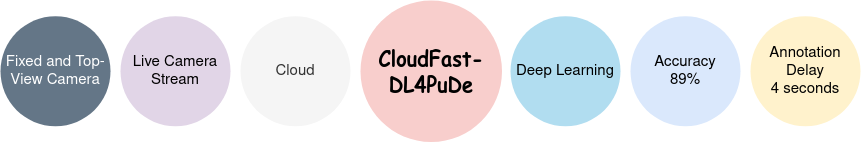

# **CloudFast-DL4PuDe:** A Cloud-based Deep Learning System for Improving Crowd Safety at Event Entrances
---

 [](./LICENSE)       [](https://colab.research.google.com/github/abualia4/CloudFast-DL4PuDe/blob/main/CFSystem.ipynb)

<p align="center">

</p>

This repisitory is for the following work
```
Ahmed Alia, ---  "A cloud-based deep learning system for improving crowd safety at event entrances", 2022
```
### Goal 
The system aims to early detect pushing patches automatically in running and crowded event entrances,  particularly in the live camera stream of entries.
### Motivation
 The motivation of the system is to help the organizers to make timely decisions before hazardous accidents develop and ensure smoother flows at entrances with higher levels of comfort and safety.
 
### The Architicture of **CloudFast-DL4PuDe** System
<p align='center'>

</p>

**Notes**
1. This <a href="https://github.com/princeton-vl/RAFT">RAFT repository</a> is used for optical flow estimation in our system.
2. Some of <a href="https://colab.research.google.com/drive/1QnC7lV7oVFk5OZCm75fqbLAfD9qBy9bw">this notebook </a> is used for live streaming in our system.

### How to Use **CloudFast-DL4PuDe** System
```
1. Click on  [](https://colab.research.google.com/github/abualia4/CloudFast-DL4PuDe/blob/main/CFSystem.ipynb)
2. File--> save a copy in drive.
3. Download the cloud-fast-system directory.
4. Upload the cloud-fast-system directory to Google Colab at the same location of the copy of CFSystem.ipynp.
        
    --Colab NoteBooks
         --copy of CFSystem.ipynp
         --cloud-fast-system
         
5. For the input stream, we recommend using a virtual camera with one of the video recordings of crowded event entrances. Video experiments are available in the video directory. <a href="https://obsproject.com/">OBS studio</a> is free and open source software for virtual camera and live streaming.
6. Run copy of CFSystem.ipynp
```
